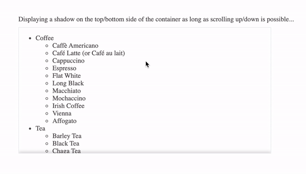

# NgxOverflowShadow

[](https://www.npmjs.com/package/ngx-notification-msg)
[](https://www.npmjs.com/package/ngx-notification-msg)

- A simple Angular directive to be used on any scrollable container for adding a shadow on the top/bottom side of the container.

## Demo

- A simple usage example can be found under `src/app` directory of this repository.

- You may also visit the online usage example on https://maormoshe.github.io/OverflowShadowLibrary/



## Installation

1. Download from npm:  
   `npm install ngx-overflow-shadow --save`

2. Import the `NgxOverflowShadowModule` module:    
   `import {NgxOverflowShadowModule} from 'ngx-overflow-shadow'`

3. Add `NgxOverflowShadowModule` to your module imports:
```ts
 @NgModule({ ... imports: [ ... NgxOverflowShadowModule ] })
 ```

## API

Put the `ngxOverflowShadow` directive selector on any scrollable container.

### Input()

| Name           | Type       | Default                          | Description                                                                    |
|----------------|:----------:|:--------------------------------:|:-------------------------------------------------------------------------------|
| top            | boolean    | false                            | Indicator for top shadow display.                                              |
| bottom         | boolean    | true                             | Indicator for bottom shadow display.                                           |
| shadowStyle    | string     | 0 0 8px 1px rgba(0, 0, 0, 0.5)   | The box-shadow style you want to apply on the top/bottom side of the container.|
